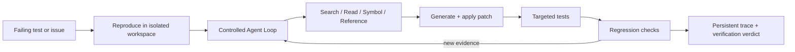

# CodeMate: Verifiable Code Repair Agent

[中文](README.md) | English

> A verifiable code repair agent for focused TypeScript and Python repositories. It locates defects through cited code evidence, generates and validates patches in isolation, and uses persistent traces and evaluation gates to prevent silent quality regressions.

## From failing test to verified patch

CodeMate does not call a generated diff a successful repair. It begins with a failing test, lets the model choose bounded local tools from the current observation, then enforces permissions, budgets, and verification with deterministic policy:

```text
Reproduce failure
  → Investigate with cited code evidence
  → Generate and apply a patch
  → Run targeted and regression tests
  → Persist the trace and verification verdict
```

Only a reproduced baseline failure followed by executed, passing target and regression tests can produce `verified_success`. `unverified_patch`, `not_reproduced`, `failed`, and `infra_error` remain distinct outcomes and never count toward Fix Success Rate.

The homepage includes a pausable 36-second guided replay based on the checked-in fixture contract. It visualizes failure, evidence gathering, a two-file patch, and strict verification. A real task uses persisted trace events rather than hidden model reasoning.

## Start the demo in 30 seconds

```bash
cp .env.example .env

# Configure a real LLM_PROVIDER, LLM_MODEL, and credential in .env
make demo
```

The launcher automatically:

1. starts the local services;
2. materializes [`examples/demo-cart-bug`](examples/demo-cart-bug) as a deterministic Git commit;
3. imports and indexes the repository without an external Git URL;
4. creates the `Interview Demo - Multi-file Cart Fix` benchmark;
5. creates one real-model repair and prints repository, Agent Timeline, and evaluation URLs.

The fixture has two related production repair points: the fixed-coupon floor in `src/cart.js` and the discounted tax basis in `src/checkout.js`. A narrow patch can pass the target test and fail full regression, naturally triggering Reflect; the workflow never manufactures a failed first attempt. See the [Demo script](docs/demo-script.md).

`make demo` explicitly rejects `LLM_PROVIDER=mock`. Mock is retained only for offline unit and deterministic smoke tests.

## One real benchmark artifact

| Dataset | Variant | Recall@5 | MRR | p95 latency |
| --- | --- | ---: | ---: | ---: |
| 30 retrieval cases | hybrid | 93.33% | 0.6956 | 17.5 ms |

This record comes from the committed [evaluation artifact](benchmarks/results/local-retrieval-latest.json), run on 2026-08-02. It is explicitly labeled `engineering_smoke_only`: it uses deterministic mock embeddings and was run from a dirty worktree, so it is **not** a production embedding-model claim. Real-model Fix@1, final Verified Fix Rate after reflection, and planner ablations remain unpublished until completed artifacts exist. See [Benchmark Results](benchmarks/results/README.md) for limits and provenance.

## The core loop



- **Cited evidence**: AST/SFC semantic chunks, hybrid retrieval, same-file context expansion, and file/line citations.
- **Controlled Agent Loop**: `PlanNextAction` is a Pydantic discriminated union; tool schemas, allowlists, call counts, tokens, time, and no-progress loops are executor-validated.
- **Isolated verification**: temporary workspaces, `git apply`, command allowlists, resource limits, and network-disabled test containers by default.
- **Recoverable trace**: action history, hypotheses, evidence, patch fingerprints, test results, and checkpoints are persisted for Timeline replay and recovery.
- **Evaluation gates**: dataset snapshots, artifacts, history comparison, and CI gates prevent silent metric and behavior regressions.

## Scope and known limits

This is deliberately constrained rather than a claim to repair every repository.

| In scope | Not claimed today |
| --- | --- |
| Focused TypeScript, JavaScript, Python, and a small Vue fixture set | Huge monorepos, multi-repository transactions, and arbitrary languages |
| Local repairs with a failing test or executable reproduction command | Large refactors, automatic PR merge, and arbitrary feature implementation |
| Reviewable diffs, explicit failure states, and regression checks | Calling a repair successful when tests did not run |
| Local/single-user development, plus signed user isolation in protected deployments | A completed industrial multi-tenant managed sandbox platform in this repo |

The main limitation is that real-model fix benchmarks have not been completed in this environment, so the corresponding metrics stay `not_run`. The demo requires the user's own valid model credential. The local demo mounts a Docker socket only into the worker to launch network-disabled test containers; it is not a production deployment topology. Protected repository import requires a signed user identity, an explicit Git-host allowlist, and a network egress policy; this repository does not present that boundary as a complete multi-tenant SaaS.

## Run and verify

For regular local development, use the deterministic Mock configuration:

```bash
cp .env.example .env
docker compose up --build
```

Common verification commands:

```bash
cd backend && ../.venv/bin/python -m pytest -q
cd frontend && npm run typecheck && npm run lint && npm run build
python scripts/benchmark_suite.py
```

## Documentation

### Core product

- [Demo script: real model, multi-file fixture, and presentation flow](docs/demo-script.md)
- [Controlled Agent Loop, tool contract, and checkpoints](docs/controlled-agent-loop.md)
- [Technical challenges and tradeoffs](docs/technical-challenges-tradeoffs.md)
- [Benchmark results, artifacts, and unpublished metrics](benchmarks/results/README.md)
- [CI Evaluation Gate](docs/ci-evaluation-gate.md)
- [PRD: rationale for the narrowed first release](docs/CodeMate_PRD_v2_enhanced.md)

### Configuration and Production Extensions

Provider setup, Evaluation RBAC, service tokens, KMS, SIEM, MCP Registry/Quota, and managed sandboxes no longer compete with the core product story:

- [Development configuration and Production Extensions](docs/development-and-production-extensions.md)
- [MCP Registry and Credential Broker](docs/mcp-registry.md)
- [MCP tenancy, quota, and approval](docs/mcp-tenancy.md), [MCP Quotas](docs/mcp-quotas.md), and [MCP approval](docs/mcp-approval-workflow.md)
- [KMS, SIEM, and staging qualification](docs/staging-qualification-kms-siem.md)
- [Managed Firecracker/Kubernetes sandbox execution plane](docs/managed-sandbox-execution-plane.md)

## Resume wording

> Designed and implemented a verifiable code repair agent for focused TypeScript/Python repositories: the model dynamically selects code search and reading tools from observations while a deterministic executor enforces schemas, budgets, and patch permissions. In an isolated sandbox, the system reproduces failures before patching, then runs target and regression tests; only complete evidence chains are marked `verified_success`. Built persistent traces/checkpoints, reviewable Diff/Timeline UX, dataset snapshots, and CI regression gates to prevent silent agent-quality regressions.
