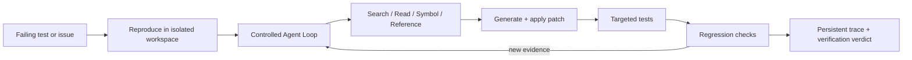

# CodeMate：可验证代码修复 Agent

中文 | [English](README.en.md)

> 面向中小型 TypeScript / Python 仓库的可验证代码修复 Agent：基于可引用的代码证据自主定位问题，在隔离环境中生成并验证补丁，并通过持久化轨迹和评测门禁防止质量退化。

## From failing test to verified patch

CodeMate 不是“生成一个 diff 就宣布成功”的代码助手。它从失败测试开始，模型根据当前 observation 动态选择受控的本地工具，执行器再以确定性的权限、预算和验证策略约束整个过程：

```text
Reproduce failure
  → Investigate with cited code evidence
  → Generate and apply a patch
  → Run targeted and regression tests
  → Persist the trace and verification verdict
```

只有修前测试真实执行且失败、修后目标测试和回归测试真实执行且 `exit_code=0`，终态才是 `verified_success`。`unverified_patch`、`not_reproduced`、`failed` 和 `infra_error` 都会保留为不同结果，不能计入 Fix Success Rate。

前端首页包含一个基于内置 fixture 合约的 36 秒可暂停运行回放：它展示失败、证据收集、双文件 patch 与严格验证的顺序。真实任务的完整 Timeline 则从持久化 trace 中读取，而不是展示模型隐藏推理过程。

## 30 秒启动 Demo

```bash
cp .env.example .env

# 在 .env 中配置真实 LLM_PROVIDER、LLM_MODEL 和对应凭据
make demo
```

启动器会自动：

1. 启动本地服务；
2. 将 [`examples/demo-cart-bug`](examples/demo-cart-bug) 制作为确定性 Git commit；
3. 导入并索引该仓库，无需外部 Git URL；
4. 建立 `Interview Demo - Multi-file Cart Fix` benchmark；
5. 创建一次真实模型修复任务，并输出仓库、Agent Timeline 与评测页面 URL。

这个 fixture 有两个相关的生产修复点：`src/cart.js` 的固定优惠券下限，和 `src/checkout.js` 的折后税基。窄 Patch 可能先通过目标测试、再在完整回归中失败并触发 Reflect；流程不会伪造第一轮失败。详见 [Demo 脚本](docs/demo-script.md)。

`make demo` 明确拒绝 `LLM_PROVIDER=mock`。Mock 仅用于离线单元测试和 deterministic smoke test。

## 一条真实 benchmark 证据

| 数据集 | 变体 | Recall@5 | MRR | p95 延迟 |
| --- | --- | ---: | ---: | ---: |
| 30 个 retrieval cases | hybrid | 93.33% | 0.6956 | 17.5 ms |

这条记录来自已提交的 [评测 artifact](benchmarks/results/local-retrieval-latest.json)，运行时间为 2026-08-02。它被明确标记为 `engineering_smoke_only`：使用 deterministic mock embedding，且运行时 worktree 为 dirty，因此**不是**生产 embedding 模型效果声明。真实模型 Fix@1、Reflect 后最终 Verified Fix Rate 与 planner 消融结果尚未发布；没有完成 artifact 就不填写百分比。完整限制与溯源见 [Benchmark Results](benchmarks/results/README.md)。

## 核心闭环



- **可引用证据**：AST/SFC 语义分块、混合检索、同文件上下文扩展以及文件/行号引用。
- **受控 Agent Loop**：`PlanNextAction` 是 Pydantic discriminated union；工具 Schema、白名单、调用次数、Token、时间和无进展循环都由执行器校验。
- **隔离验证**：临时 workspace、`git apply`、命令白名单、资源限制和默认禁网测试容器。
- **可恢复轨迹**：action history、hypothesis、evidence、patch fingerprint、测试证据与 checkpoint 被持久化，可供 Timeline 重放与故障恢复。
- **评测门禁**：数据集快照、运行 artifact、历史对比和 CI gate 共同防止指标或行为静默退化。

## 项目范围与已知限制

这是一个刻意收敛的项目，而不是宣称修复任意代码库的通用自治开发者。

| 已聚焦的范围 | 当前不承诺 |
| --- | --- |
| 中小型 TypeScript、JavaScript、Python，少量 Vue fixture | 超大 monorepo、多仓库事务和任意语言 |
| 有失败测试或可执行复现命令的局部修复 | 大规模重构、自动合并 PR、任意业务需求实现 |
| 可审查 patch、显式失败状态、回归验证 | 未执行测试时的“修复成功” |
| 本地 Docker 沙箱与生产执行平面对接 | 在本仓库中声明已完成工业级多租户托管平台 |

主要限制是：真实模型 fix benchmark 尚未在当前环境完成，性能指标因此保持 `not_run`；Demo 需要用户自己的有效模型凭据；本地 Demo 为了运行禁网测试容器，会仅向 worker 挂载本地 Docker socket，不能直接当作生产部署拓扑。

## 运行与验证

普通本地开发可使用 deterministic Mock：

```bash
cp .env.example .env
docker compose up --build
```

常用验证命令：

```bash
cd backend && ../.venv/bin/python -m pytest -q
cd frontend && npm run typecheck && npm run lint && npm run build
python scripts/benchmark_suite.py
```

## 文档导航

### 主产品

- [Demo 脚本：真实模型、多文件 fixture 与讲解顺序](docs/demo-script.md)
- [受控 Agent Loop、工具契约与 Checkpoint](docs/controlled-agent-loop.md)
- [技术难点与取舍](docs/technical-challenges-tradeoffs.md)
- [Benchmark 结果、artifact 和未发布指标](benchmarks/results/README.md)
- [CI Evaluation Gate](docs/ci-evaluation-gate.md)
- [PRD：首期范围收缩理由](docs/CodeMate_PRD_v2_enhanced.md)

### 配置与 Production Extensions

Provider、Evaluation RBAC、service token、KMS、SIEM、MCP Registry/Quota 和托管沙箱不再挤占主产品叙事，统一见：

- [开发配置与 Production Extensions](docs/development-and-production-extensions.md)
- [MCP Registry 与 Credential Broker](docs/mcp-registry.md)
- [MCP 租户授权、Quota 与审批](docs/mcp-tenancy.md)、[MCP Quotas](docs/mcp-quotas.md)、[MCP 审批](docs/mcp-approval-workflow.md)
- [KMS、SIEM 与 staging qualification](docs/staging-qualification-kms-siem.md)
- [托管 Firecracker/Kubernetes 沙箱执行平面](docs/managed-sandbox-execution-plane.md)

## 简历表述

> 设计并实现面向中小型 TypeScript/Python 仓库的可验证代码修复 Agent：模型根据观测动态选择代码检索与阅读工具，确定性执行器对 Schema、预算和补丁权限做约束；在隔离沙箱中先复现失败、再运行目标与回归测试，仅将完整证据链通过的任务记为 `verified_success`。实现持久化执行轨迹、checkpoint、可审查 Diff/Timeline 以及数据集快照和 CI regression gate，避免 Agent 质量静默退化。
