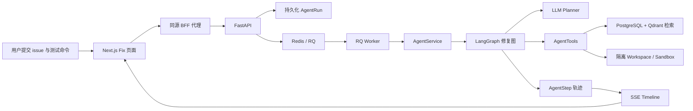
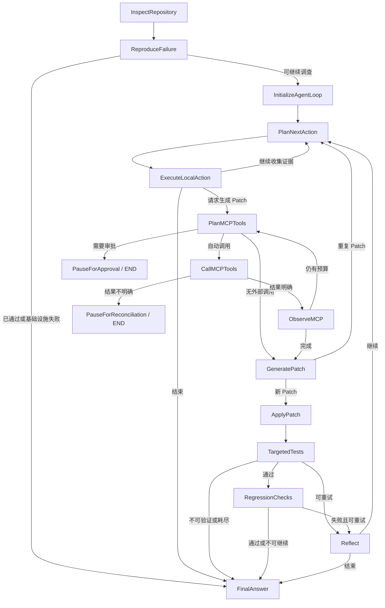
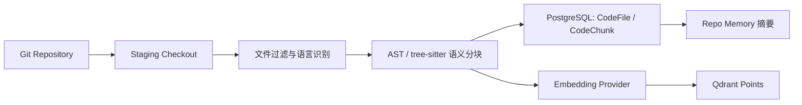

# CodeMate 代码阅读与 Agent 项目学习指南

这份指南面向两种场景：第一次系统阅读 CodeMate，以及用它学习一个生产化 Agent 项目应该如何设计。建议先沿主修复闭环阅读，再进入 MCP、评测和托管执行平面等扩展能力。

> 一句话理解 CodeMate：它不是“让大模型直接执行命令”，而是让模型在受控动作集合中提出下一步建议，再由确定性系统负责授权、执行、持久化和验证。

## 1. 先建立正确的心智模型

阅读代码前先记住三条原则：

1. **模型负责提议，系统负责授权。** 本地调查 Planner 每轮只返回一个结构化 `PlanNextAction`，不能直接获得 shell 或文件系统权限；MCP Planner 和 Patch Provider 有各自独立的输出契约。
2. **生成 Patch 不等于修复成功。** 只有修前确实复现失败，且修后目标测试和回归测试都真实执行并通过，结果才是 `verified_success`。
3. **运行状态、恢复状态和展示轨迹不是同一份数据。** `AgentRun`、LangGraph checkpoint、`AgentStep` 分别服务于业务结果、机器恢复和用户审计。

主链路可以压缩成下面这张图：



真正值得学习的不是某一个 Prompt，而是这些边界如何协作：

```text
非确定性的模型决策
        ↓ 结构化 Schema
确定性的策略与工具执行
        ↓ 原始执行证据
确定性的验证结论
        ↓ 脱敏持久化
可恢复、可审计、可评测的 Agent Run
```

## 2. 仓库地图

| 目录 | 职责 | 阅读时重点 |
| --- | --- | --- |
| `backend/app/api/` | FastAPI 路由和身份边界 | 请求如何进入系统、owner 如何校验、长任务如何返回 |
| `backend/app/services/` | 业务编排 | Agent、索引、检索、评测、MCP 如何组合 |
| `backend/app/agent/` | 修复 Agent 核心 | 动作 Schema、状态、图、执行器、工具、验证和 checkpoint |
| `backend/app/llm/` | 模型 Provider | Prompt、上下文裁剪、结构化输出和 Token 统计 |
| `backend/app/indexing/` | 代码语义分块 | Python/TS/JS/Vue 如何变成带符号和行号的 chunk |
| `backend/app/vectorstore/` | Qdrant 适配 | 向量写入、按 repo 隔离和相似度搜索 |
| `backend/app/sandbox/` | Patch 与测试执行 | 临时工作区、路径限制、命令白名单和运行时隔离 |
| `backend/app/models/` | SQLAlchemy 数据模型 | Repository、Chunk、Run、Step、Checkpoint 的关系 |
| `backend/app/workers/` | RQ 后台任务 | API 与长时间 Agent 执行如何解耦 |
| `frontend/app/` | Next.js 页面与 BFF | 仓库、Chat、Fix、Evaluation 页面和服务端代理 |
| `frontend/components/agent/` | Agent 可视化 | Timeline、Patch、测试证据、审批和对账如何展示 |
| `backend/tests/`、`frontend/tests/` | 自动化验证 | 安全性质、状态路由、恢复、竞态和 UI 证据展示 |
| `benchmarks/`、`scripts/` | 评测与自动化 | Retrieval/Fix 指标、数据集、artifact 和 regression gate |
| `docs/` | 架构与能力边界 | 主闭环、ADR、MCP、托管执行平面和证据等级 |

主要技术栈：

- 后端：FastAPI、SQLAlchemy、Alembic、Pydantic、LangGraph、RQ/Redis。
- 检索：PostgreSQL 元数据/全文检索、Qdrant 向量检索、AST/tree-sitter 语义分块。
- 执行：临时 Git workspace、Docker 或托管执行 Broker、默认禁网测试。
- 前端：Next.js、React、TypeScript、SSE。
- 验证：pytest、Hypothesis、Vitest、Playwright，以及独立 benchmark/evaluation gate。

## 3. 七个关键数据结构

先读数据，再读控制流，理解速度会快很多。

| 数据结构 | 定义位置 | 它回答的问题 | 关键不变量 |
| --- | --- | --- | --- |
| `Repository` / `CodeFile` / `CodeChunk` | `backend/app/models/` | 仓库索引里有什么？ | Chunk 必须带 repo、文件、符号和行号，引用才能回到源码 |
| `AgentRun` | `backend/app/models/agent_run.py` | 这次任务对用户而言处于什么状态？ | owner、终态、最终 Diff、验证结果和反馈是业务事实 |
| `FixAgentState` | `backend/app/agent/state.py` | 图的下一节点需要哪些机器状态？ | 字段会进入 checkpoint，也是恢复协议的一部分 |
| `PlanNextAction` | `backend/app/agent/actions.py` | 模型本轮被允许建议什么？ | discriminated union、`extra="forbid"`、字段边界必须先通过 |
| `TestResult` | `backend/app/sandbox/runner.py` | 测试是否真的执行以及如何失败？ | `passed` 必须与 `tests_ran`、`exit_code`、超时和 failure kind 一致 |
| `AgentStep` | `backend/app/models/agent_step.py` | 用户能审计到哪些动作和证据？ | 公开字段先脱敏；它是观察轨迹，不是隐藏思维链 |
| `AgentCheckpoint*` | `backend/app/models/agent_checkpoint.py` | Worker 中断后从哪里恢复？ | checkpoint、channel blob、pending write 与同一 `run_id` 绑定 |

### 3.1 三种“状态”为什么不能合并

```text
AgentRun
  面向产品：pending/running/waiting/terminal、final_diff、test_result

FixAgentState + AgentCheckpoint
  面向机器：当前节点、证据、预算、游标、Patch 指纹、恢复数据

AgentStep
  面向人：可展示且已脱敏的 plan/tool/test/verification 事件
```

如果只保留 `AgentRun`，Worker 崩溃后不知道从哪个节点继续；如果只保留 checkpoint，前端无法安全、稳定地展示审计轨迹；如果拿 Timeline 当机器状态，展示格式变化就会破坏恢复逻辑。因此三者是刻意分开的。

## 4. 一次 Fix 请求如何进入 Agent

从入口按下面顺序跟读：

```text
frontend/app/repos/[repoId]/fix/page.tsx::handleSubmit
  → frontend/lib/api.ts::createFixRun
  → frontend/app/api/backend/[...path]/route.ts::proxyBackend
  → backend/app/api/routes/repos.py::create_fix_run
  → backend/app/services/agent_service.py::create_fix_run
  → backend/app/core/queue.py::enqueue_agent_run
  → backend/app/workers/jobs.py::run_agent_job
  → backend/app/services/agent_service.py::run_fix
```

这条链路里有几个重要设计：

1. 浏览器只请求同源 `/api/backend/*`。Token、HttpOnly Session 到签名身份的转换都在 BFF 内完成。
2. 后端先校验 repository 属于当前 owner 且已完成索引。
3. `AgentRun(status="pending")` 先提交数据库，再把 `run_id` 放入 RQ。Worker 不会拿到一个尚未提交的 ID。
4. Redis 入队失败时，Run 会被明确写成 `infra_error`，而不是永远停留在 `pending`。
5. Worker 每次创建新的数据库 Session，调用 `AgentService.run_fix(run_id)`；重试恢复依赖持久化状态，不依赖上次进程内对象。
6. `run_agent_job` 结束后还会同步 GitHub App repair 结果，但这属于外围集成，不改变修复图的成功语义。

## 5. 先读懂确定性的修复图

核心文件是 [`backend/app/agent/graph.py`](../backend/app/agent/graph.py)。先不要钻进每个节点的实现，只看节点和边。



### 5.1 每个节点真正负责什么

| 节点 | 主要输入 | 主要输出 | 为什么不能交给模型决定 |
| --- | --- | --- | --- |
| `InspectRepository` | 用户测试命令、workspace | 目标测试与回归命令 | 命令探测和白名单属于执行策略 |
| `ReproduceFailure` | 修前代码、目标命令 | `baseline_test_result` | 没有修前失败，就无法证明 Patch 修复了问题 |
| `InitializeAgentLoop` | 当前时间、预算配置 | 开始时间和 deadline | 防止无限循环必须使用系统时钟 |
| `PlanNextAction` | issue、历史、证据、剩余预算 | 一个结构化动作 | 模型适合做下一步调查选择，但输出仍不可信 |
| `ExecuteLocalAction` | 结构化动作、状态 | 新 observation/evidence | 白名单、预算、去重必须是确定性的 |
| `Plan/Call/ObserveMCP` | 可用外部工具与证据 | 外部 observation | 所有调用经过策略校验；仅策略要求且审批开启时等待审批，只有远端结果不明确时进入对账 |
| `GeneratePatch` | diagnosis、明确读取过的文件 | unified diff | 只生成候选，不拥有应用或成功权限 |
| `ApplyPatch` | unified diff | Git apply 证据 | Patch 必须由隔离执行器验证可应用 |
| `TargetedTests` | 用户/探测出的目标命令 | 目标测试证据 | 证明报告的问题被修复 |
| `RegressionChecks` | 优先使用独立探测出的仓库命令，缺失时回退目标命令 | 回归测试证据 | 防止局部修复破坏其他行为；即使命令相同也会独立执行第二阶段 |
| `Reflect` | 最近一次失败 | 新 evidence、已重置 workspace | 当前实现是确定性失败归档，不调用模型“思考” |
| `FinalAnswer` | 所有原始阶段证据 | 终态、summary、diff | 最终成功必须由规则计算，不能相信生成文本 |

### 5.2 一个容易误读的细节

`ReproduceFailure` 之后，baseline 为 `passed` 或 `infra_error` 会直接结束；`failed` 会进入调查。若测试命令缺失导致 `skipped/not_run`，图可能继续收集信息并生成 Patch，但最终验证仍要求 baseline 确实为 `failed`，所以绝不可能得到 `verified_success`。

`iterations` 在每次 `TargetedTests` 后增加，实际代表已经验证过的 Patch 尝试次数，而不是 Planner 调用次数。

## 6. 受控 Agent Loop：模型与执行器如何分工

建议按这个顺序阅读：

1. [`backend/app/agent/actions.py`](../backend/app/agent/actions.py)
2. [`backend/app/agent/loop.py`](../backend/app/agent/loop.py)
3. [`backend/app/agent/tools.py`](../backend/app/agent/tools.py)
4. [`backend/app/llm/openai_compatible_provider.py`](../backend/app/llm/openai_compatible_provider.py)

### 6.1 模型可以选择的动作

`PlanNextAction` 是带 `action` discriminator 的 Pydantic union：

| 动作 | 用途 | 重要限制 |
| --- | --- | --- |
| `SearchCode` | 混合检索候选代码块 | `top_k` 有边界 |
| `ReadFile` | 读取明确文件和行段 | 路径、行号和最大行数受限 |
| `ListFiles` | 查看 workspace 文件 | 可选 glob，不能越出 workspace |
| `FindSymbol` | 找精确符号定义 | 基于已索引 chunk |
| `FindReferences` | 找符号文本引用 | 是候选关系，不是编译器级引用解析 |
| `GetImportGraph` | 查看 import/importer 候选 | 深度、节点和边有上限 |
| `GetCallGraph` | 查看 caller/callee 候选 | 启发式静态导航，存在局限 |
| `RunTests` | 运行诊断测试 | 命令必须精确命中 allowlist |
| `GeneratePatch` | 请求进入 Patch 阶段 | 它只是路由信号，不代表成功 |
| `Finish` | 请求停止调查 | 最终状态仍由验证模块计算 |

新增一个动作不能只改 Prompt。完整链路至少要同步：

```text
Pydantic action model
  → PlanNextAction union
  → LOCAL_TOOL_ACTIONS（若为本地工具）
  → LocalAgentExecutor._dispatch
  → AgentTools 实现与审计
  → Planner Prompt/Schema
  → 状态更新
  → 安全与回归测试
```

### 6.2 双重校验不是重复劳动

模型 Provider 在反序列化响应时先校验 `PlanNextAction`，`LocalAgentExecutor.execute` 在工具边界再次校验同一个 union。

- 第一层让模型错误尽早暴露，返回更清晰的 provider 错误。
- 第二层是可信执行边界，保护未来新增的 Provider、Mock 或其他调用方。
- `extra="forbid"` 让未知字段 fail closed，避免模型偷偷夹带未定义参数。
- 未知动作、超长读取、非白名单测试命令都不会进入工具实现。

### 6.3 为什么 Search 后通常还要 Read

`SearchCode` 返回带文件、符号、行号和片段的检索结果，Agent state 仍会保留完整 observation。当前 OpenAI-compatible Provider 在构造发给模型的 Planner 上下文时，会把搜索结果裁剪为定位元数据；Mock 或其他 Provider 不一定采用同一裁剪策略。无论 Provider 如何处理 Planner 上下文，只有显式 `ReadFile` 才会填充 `state.files`，而 Patch Generator 只接收 `files`。

这形成了一条可审计的证据路径：

```text
搜索发现候选位置
  → Planner 明确选择读取哪个文件
  → ReadFile 受路径和行数限制
  → 文件内容进入 Patch 上下文
  → 生成最小 Diff
```

这样既控制 Token，也避免一次宽泛检索把大量不可信仓库文本直接送入修改阶段。

### 6.4 预算与停机规则

默认值来自 `.env.example` 和 `backend/app/core/config.py`：

| 预算 | 默认值 | 防止的问题 |
| --- | ---: | --- |
| 本地工具调用 | 12 | 无限制搜索、读取或测试 |
| Planner 调用 | 16 | 无限 Agent 轮次 |
| Planner Token | 24000 | 单 Run 成本失控 |
| Loop 总时间 | 600 秒 | Worker 长时间占用 |
| 连续无进展次数 | 3 | 换种说法重复同一调查 |
| 单次读取行数 | 800 | 大文件一次塞满上下文 |
| Patch 尝试 | 3 | 不断生成失败 Diff |

Provider 会在请求前估算输入 Token，避免一次超大 Prompt 直接越过剩余预算；执行器还会检查调用次数、deadline 和无进展计数。

### 6.5 两种指纹解决两类循环

- **Action fingerprint** 只包含执行参数，不包含 `hypothesis` 和 `rationale`。模型不能仅改写解释就重复执行同一工具。
- **Evidence fingerprint** 来自工具结果。即使动作不同，只要得到同样结果，也不会被算作新进展。
- **Patch fingerprint** 来自 Diff。Reflect 后再次生成完全相同的 Patch 会被拒绝，不会重复应用和测试。

这比只设置 `max_steps` 更好：系统不仅限制总量，还能识别“看似在行动，实际上没有获得新信息”的循环。

## 7. 索引与 RAG：Agent 的代码知识从哪里来

建议先看：

1. `backend/app/services/index_service.py`
2. `backend/app/indexing/filters.py`
3. `backend/app/indexing/chunkers/`
4. `backend/app/services/retrieval_service.py`
5. `backend/app/vectorstore/qdrant_store.py`

### 7.1 索引链路



分块不是固定字符窗口。Python 使用 AST，TS/JS/Vue 使用对应语义解析器，尽量保留函数、类、方法、组件、import/export 和起止行号。这些元数据决定了后续 citation 能否回到真实源码。

全量和增量索引都要同时协调 checkout、PostgreSQL 和 Qdrant，但三者无法共享一个事务。因此 `IndexService` 使用 staging workspace、backup workspace、新旧 point ID 和补偿清理：只有新数据库视图提交成功后，才删除旧 workspace/vector；中间失败则回滚数据库并恢复外部状态。

### 7.2 检索链路

```text
Query rewrite
  → Keyword/FTS candidates
  + Vector candidates
  → Reciprocal Rank Fusion
  → Deterministic rerank
  → Same-file context expansion
  → 带 path/symbol/line 的结果
```

为什么不是直接把两种 score 相加？全文检索分数和向量相似度没有共同尺度。RRF 只使用各自排名位置，再由确定性 rerank 奖励精确文件名、符号名、错误名和关键词命中。

向量服务异常时，hybrid 模式仍可退化到关键词结果；这是一种可解释降级，不会伪造向量召回成功。

`GetImportGraph` 和 `GetCallGraph` 是导航候选，不是编译器级语义图。它们不完整解析 alias、动态派发、重载、re-export 或跨语言调用，所以正确使用方式是：先用图缩小范围，再 `ReadFile` 验证源码。

## 8. Sandbox：为什么执行结果可以被信任

核心文件是 [`backend/app/sandbox/runner.py`](../backend/app/sandbox/runner.py)。

一次修复不会直接修改索引仓库，而是：

1. 为 `run_id` 创建临时 workspace。
2. 复制允许的仓库内容，并拒绝读取 symlink、绝对路径和含 `..` 的路径。
3. 使用 `git apply` 应用 unified diff。
4. 对新增未跟踪文件使用 intent-to-add，使最终 `git diff` 能包含它们。
5. 在最终执行边界再次精确校验测试命令 allowlist。
6. 使用 Docker/gVisor 配置或托管执行 Broker 运行测试。直接容器路径显式设置网络、CPU、内存和超时；Broker 请求只传递受控命令、镜像、runtime 与 timeout，CPU、内存和网络隔离取决于选用的 execution-plane backend 与部署策略，当前没有 staging artifact 可以证明该路径已经完成资格验证。
7. 将结果归一化为 `TestResult`。
8. Reflect 时重置本次临时 workspace；整个图结束后在 `finally` 中清理。

### 8.1 `passed` 为什么仍然是不可信输入

远端执行器或适配层即使返回 `passed=true`，`TestResult.__post_init__` 仍会结合这些字段重新派生：

- `tests_ran` 是否为真；
- `exit_code` 是否为 0；
- 是否超时；
- 是否被标记为 skipped 或 infrastructure failure。

依赖安装在测试开始前失败会使用基础设施语义，不能混成业务测试失败。无测试命令会记录为 skipped，永远不能成为成功；只有 Patch 已应用时终态通常才是 `unverified_patch`，否则仍可能是 `failed`。

### 8.2 本地 Demo 与生产隔离不要混淆

本地 demo overlay 为了启动禁网测试容器，会给 Worker 挂载 Docker socket。这是开发便利，不是可直接照搬的多租户生产拓扑。仓库中的 Firecracker/Kata、Kubernetes 清单和 qualification 脚本展示了控制面设计，但在没有真实环境 artifact 前，不应把它描述为已经完成 staging 验证。

## 9. 严格验证：成功状态从哪里来

核心文件是 [`backend/app/agent/verification.py`](../backend/app/agent/verification.py)。它是修复图完成后，根据阶段证据计算 verdict 的权威；入队失败、仓库不可用等图外编排故障仍可由 API 或 `AgentService` 直接终止为 `infra_error`。

```text
verified_success =
  baseline 确实 failed
  AND patch apply ok
  AND targeted tests_ran=true, exit_code=0, passed=true
  AND regression tests_ran=true, exit_code=0, passed=true
```

终态要保留不确定性，而不是把所有非成功压成一个 `failed`：

| 状态 | 含义 |
| --- | --- |
| `verified_success` | 修前失败已复现，Patch 后目标与回归均真实通过 |
| `unverified_patch` | Patch 已应用，但某个必要测试未实际运行 |
| `not_reproduced` | 修前测试已通过，无法证明原问题存在 |
| `failed` | Patch 未应用或测试在最大迭代内仍失败 |
| `infra_error` | 沙箱、依赖、超时或执行基础设施使验证不可信 |

注意三层防线：

1. `SandboxService` 规范化原始测试结果。
2. `verification.py` 从阶段证据计算 verdict。
3. `_persist_final_state` 在数据库落库前再次检查 `verified_success` 的证据完整性。

模型 summary 声称成功或调用方错误设置 status，都不能在缺少结构化测试证据时绕过最后一道校验。这里是数据库落库边界上的 fail-closed 业务证据检查，不等于普通 LangGraph checkpoint 具有防数据库篡改的密码学签名。

## 10. Checkpoint、重试与恢复

按下面顺序阅读：

1. `backend/app/agent/checkpointer.py`
2. `backend/app/models/agent_checkpoint.py`
3. `AgentService._invoke_fix_graph`
4. `AgentService._rehydrate_checkpoint_workspace`

每个 `AgentRun.id` 同时作为 LangGraph `thread_id`。Worker 重试时：

```text
读取 snapshot
  → 已完整结束：直接返回已保存状态
  → 存在 next nodes：按需要重建临时 workspace，再 graph.invoke(None)
  → 没有 checkpoint：使用 initial state 启动
```

为什么 checkpoint 不能保存整个 workspace？文件系统快照体积大、难事务化，也不适合直接塞进数据库。这里持久化的是逻辑状态和 Patch；恢复到需要“已应用 Patch”的后续节点时，系统在新 workspace 中重新应用已保存 Diff。

系统不会在所有恢复节点都重放 Patch。只有 checkpoint 证明 Patch 已成功应用，并且下一个节点确实假设文件已经修改时才重放，避免把调查阶段污染成修后代码。

RQ 的退避重试、LangGraph checkpoint 和 MCP domain checkpoint 分工不同：

- RQ Retry：重新调度一个失败的后台任务。
- LangGraph checkpoint：恢复普通图节点和 channel 状态。
- MCP approval/execution checkpoint：绑定外部调用参数、审批、游标、完整性哈希和副作用恢复。

## 11. Timeline 与前端：如何展示一个长时间 Agent

后端数据链路：

```text
AgentStepService.record / record_tool
  → 公共 payload 脱敏
  → 可选 restricted payload envelope encryption
  → AgentStep 持久化
  → runs.py::_trace_events 每秒读取
  → _step_payload 转成 TraceEvent
  → SSE
```

`record_tool` 把调用和结果记录成两个事件。Worker 如果在中间崩溃，Timeline 会留下“已发起但没有结果”的事实，而不会伪造成一个完成事件。

前端建议按下面顺序读：

1. `frontend/lib/types.ts`
2. `frontend/lib/api.ts`
3. `frontend/app/api/backend/[...path]/route.ts`
4. `frontend/app/repos/[repoId]/fix/page.tsx`
5. `frontend/components/agent/AgentTimeline.tsx`
6. `frontend/components/agent/TestResultPanel.tsx`

### 11.1 BFF 是安全边界，不只是转发器

BFF 会过滤 hop-by-hop headers，只从服务端注入后端 Token，并把 method、path/query、timestamp、nonce 与用户身份一起签名。后端消费 nonce 防重放。因此浏览器无法选择可信 owner header，也看不到后端凭证。

SSE response body 被直接透传而不缓冲，否则 Timeline 会等连接结束后才一次性出现。

### 11.2 Fix 页面最值得学习的竞态处理

- `activeRunIdRef` 是 active-run identity guard，旧 Run 的 REST/SSE 回调不能覆盖新 Run；它并不解决同一 Run 内多个并发 REST 刷新的响应先后问题。
- `loadedUrlRunIdRef` 防止 `router.replace` 后旧 URL effect 把页面切回上一个 Run。
- 页面重开或重新建立 trace 连接时，后端会从头重放持久化 Step，所以前端按 `event.id` 去重。
- SSE 断开只代表传输错误，不等于 Agent 失败；当前实现会重新读取持久化 Run，但不会自动重新订阅后续 Timeline。
- `pending`、`running`、`waiting_approval`、`waiting_reconciliation` 都不是终态，不能提前解锁重复提交。
- Diff 优先使用非空的 `AgentRun.final_diff`，为空时回退到最新 Patch 事件；Tests 在 Run 已加载后使用 `AgentRun.test_result/status`，加载前才使用最新测试事件。后端 Run/verification 仍是终态判断的权威来源。

`TestResultPanel` 只有在 `passed=true`、`tests_ran=true` 且 `exit_code=0` 时才显示通过；最终状态分类仍以后端 verification 为准。

### 11.3 Timeline 不是 Chain-of-Thought

用户看到的是结构化 action、tool call、observation、Patch 和测试证据。这些是可观察决策与结果，不是模型隐藏推理过程。代码中保存的 `hypothesis` 也应当理解为可审计的任务假设，而不是要求系统暴露内部思维链。

### 11.4 用 Repo 与 Chat 支线理解“RAG 不等于 Agent”

仓库详情页每 3 秒并行读取 repository 与 indexing status。只有 `status=indexed` 且 `indexed_at` 存在时才读取 Repo Memory 和 CI；二者使用 `Promise.allSettled`，因此一项失败不会抹掉另一项已经成功的结果。重新索引时先清空这些派生视图，再由新的索引状态触发刷新。

Chat 链路比 Fix 短，适合先理解检索证据如何进入模型：

```text
POST /repos/:repoId/chat（JSON question）
  → RetrievalService.retrieve
  → 全部 bounded results 转成 LLMContext
  → LLM answer token SSE
  → 前 5 个检索结果转成 citation SSE（多仓 Chat 上限为 8）
  → done
```

由于请求必须携带 JSON body，浏览器不能使用只支持 GET 的原生 `EventSource`，而是通过 `fetch` 读取 `ReadableStream`，按 SSE 空行拆帧。网络 chunk 不等于 SSE frame，所以解析器必须保留未完成的尾部 buffer。当前前后端还共享“每帧只有一行 JSON `data:`”这一契约；后端若改成 multiline data，前端解析器也必须同步。

点击 `CitationCard` 后，前端再按 citation 的 repo、路径和精确行段请求文件内容。Chat 给的是可引用回答，没有 Action Loop、Patch 应用或严格验证；Fix Agent 则会把检索只当调查手段，后续还必须经过受控工具、状态机和测试证据。这正是 RAG 问答与可执行 Agent 的核心区别。

## 12. MCP 子循环：主线掌握后再读

不启用 MCP 时，`PlanMCPTools` 会很快路由到 `GeneratePatch`，因此它不是理解基本修复闭环的前置条件。

启用后，MCP 用来引入外部动态工具，但必须经过：

```text
Catalog discovery
  → Planner proposal
  → catalog / schema / policy / duplicate / call-budget validation
  → policy=approval_required 且 approval 开关启用：持久化人工审批
    approval 开关关闭：以 approval_workflow_disabled 拒绝
    或 policy=auto：durable execution + idempotency key
  → 远端调用边界在相应开关启用时执行 tenant authorization 与 quota
  → observation（仍是不可信数据）
  → Patch generator
```

两个暂停状态尤其重要：

- `waiting_approval`：目录策略为 `approval_required` 且审批功能启用时，工具等待人工决定。
- `waiting_reconciliation`：远端调用结果不明确，等待确认成功、失败或安全重试。

暂停节点会结束当前 Worker invocation，不会占住 RQ Worker 等人操作。之后由新的 resume job 根据 `resume_from` 从 `mcp_observe` 或 `mcp_call` 继续。

一次只持久化第一个待审批调用；其余审批请求和自动调用分别标记为 `approval_deferred` 与 `deferred_for_approval`。审批恢复后由 Planner 基于新状态重新规划，且只有剩余 round/call budget 允许时才可能再次提出这些调用。这样不会同时为同一个 checkpoint 建立多个可恢复的审批分支。

MCP observation 在加入 diagnosis 时被明确标为 untrusted data；它可以提供证据，但不能通过文本内容给自己授予新权限。

当前客户端实现的是 Streamable HTTP MCP，不代表可以无约束接入任意 stdio MCP server。

> 注意：`BaseLLMProvider.reflect()` 并不是当前 Fix 图的 Reflect 实现。当前 `Reflect` 节点是确定性的失败证据归档与 workspace reset。

## 13. 测试是第二份设计文档

推荐按主题阅读测试，而不是从头扫完整个 `tests/`：

| 想理解的能力 | 测试文件 |
| --- | --- |
| Action Schema、重复动作、预算、命令白名单 | `backend/tests/test_agent_loop.py` |
| 任意未知动作和 Prompt injection 安全性质 | `backend/tests/test_agent_safety_properties.py` |
| 图节点顺序、严格终态和失败分类 | `backend/tests/test_agent_verification.py` |
| 真实检索→Reflect→新 Patch→验证闭环 | `backend/tests/test_agent_graph_integration.py` |
| Checkpoint 保存与恢复 | `backend/tests/test_agent_checkpointer.py` |
| import/call 静态导航的能力与局限 | `backend/tests/test_agent_graph_tools.py` |
| AST 分块、RRF、rerank、context expansion | `backend/tests/test_chunkers_and_retrieval.py` |
| symlink、路径和新文件 Diff | `backend/tests/test_sandbox_runner_security.py` |
| Timeline 脱敏与受限 payload | `backend/tests/test_agent_step_security.py` |
| 前端 Timeline/Test verdict | `frontend/tests/agent-presentation.test.tsx` |
| Run 切换、断流和重复提交竞态 | `frontend/tests/fix-page.test.tsx` |

重点关注测试命名中的业务断言，例如：

- `test_executor_blocks_duplicate_search_without_calling_tool_twice`
- `test_verified_success_requires_reproduction_and_both_post_patch_suites`
- `test_full_agent_graph_retrieves_reflects_and_verifies_a_distinct_retry`
- `test_planner_marks_malicious_repository_content_as_untrusted_data`

这些名称比某个实现函数更能说明系统想守住的不变量。

## 14. 推荐的分阶段阅读路线

### 第一阶段：两小时读懂核心闭环

1. `README.md`：确认产品边界。
2. `backend/app/agent/state.py`：知道图里流动什么。
3. `backend/app/agent/actions.py`：知道模型能做什么。
4. `backend/app/agent/graph.py`：画出状态机。
5. `backend/app/agent/verification.py`：理解什么才算成功。
6. `backend/tests/test_agent_verification.py`：用测试校准理解。

这一阶段完成后，应该能回答：“为什么模型不能自己宣布修复成功？”

### 第二阶段：半天理解 Agent 如何调查代码

1. `backend/app/agent/loop.py`
2. `backend/app/agent/tools.py`
3. `backend/app/llm/openai_compatible_provider.py::plan_next_action`
4. `backend/app/services/retrieval_service.py`
5. `backend/tests/test_agent_loop.py`
6. `backend/tests/test_agent_safety_properties.py`

这一阶段完成后，应该能回答：“模型如何从 observation 选择下一步，同时又不能越权？”

### 第三阶段：半天理解生产化编排

1. `backend/app/api/routes/repos.py::create_fix_run`
2. `backend/app/core/queue.py::enqueue_agent_run`
3. `backend/app/workers/jobs.py::run_agent_job`
4. `backend/app/services/agent_service.py`
5. `backend/app/agent/checkpointer.py`
6. `backend/app/services/agent_step_service.py`
7. `backend/app/api/routes/runs.py`

这一阶段完成后，应该能回答：“Worker 崩溃、重试或等待人工审批时，为什么 Run 不会丢？”

### 第四阶段：理解数据与执行可信度

1. `backend/app/services/index_service.py`
2. `backend/app/indexing/chunkers/`
3. `backend/app/services/retrieval_service.py`
4. `backend/app/sandbox/runner.py`
5. 对应 retrieval/sandbox 测试。

这一阶段完成后，应该能回答：“Agent 的代码证据来自哪里，执行结果为什么可信？”

### 第五阶段：前端、评测和扩展能力

1. Fix 页面、Timeline、TestResultPanel。
2. `backend/app/services/evaluation_service.py` 和 Evaluation Center 页面。
3. `benchmarks/` 与 `scripts/benchmark_suite.py`。
4. MCP router、approval、execution、quota。
5. `docs/managed-sandbox-execution-plane.md` 和相关 ADR。

## 15. 本地学习与验证命令

项目要求 Python 3.11+，容器和 CI 的前端基线是 Node.js 20。还需要 Git；若运行容器链路，需要 Docker Engine 与 Compose。首次安装依赖、拉取镜像和真实模型调用都需要相应网络。以下命令均假设当前目录是项目根目录，并且每个代码块都可以独立执行：

```bash
python3 -m venv .venv
.venv/bin/python -m pip install -r backend/requirements-dev.txt
npm --prefix frontend ci
```

### 15.1 最快的核心测试

```bash
DATABASE_MIGRATIONS_ENABLED=false .venv/bin/python -m pytest -q \
  backend/tests/test_agent_loop.py \
  backend/tests/test_agent_verification.py \
  backend/tests/test_agent_graph_integration.py \
  backend/tests/test_agent_checkpointer.py \
  backend/tests/test_agent_safety_properties.py
```

前端核心测试：

```bash
npm --prefix frontend run test -- \
  tests/agent-presentation.test.tsx \
  tests/fix-page.test.tsx
```

### 15.2 常用静态、单元与构建验证

```bash
.venv/bin/ruff check backend/app backend/tests
.venv/bin/python -m compileall -q backend/app
DATABASE_MIGRATIONS_ENABLED=false .venv/bin/python -m pytest -q backend/tests

npm --prefix frontend run lint
npm --prefix frontend run typecheck
npm --prefix frontend run test
npm --prefix frontend run build
```

这组命令不是完整 production-readiness 证明。CI 还包含 Agent 分支覆盖率门槛、沙箱 qualification 脚本检查、Compose build、迁移往返以及受保护 E2E 等环境相关验证，具体以 [`.github/workflows/production-readiness.yml`](../.github/workflows/production-readiness.yml) 为准。

评测数据集合约检查（不是模型效果评测）：

```bash
PYTHONDONTWRITEBYTECODE=1 PATH="$PWD/.venv/bin:$PATH" \
  .venv/bin/python scripts/benchmark_suite.py
```

`PYTHONDONTWRITEBYTECODE=1` 避免本机解释器改写 fixture 中被跟踪的 `__pycache__`。该脚本校验并物化 5 个 fixture、30 个 retrieval case 和 20 个 fix case，确认 fixture commit 可确定性复现、修前 baseline 失败且 health control 通过。它不会启动索引/检索 Agent，不会调用真实 LLM，也不会产出模型检索质量或修复成功率指标。

### 15.3 启动方式的区别

普通本地栈默认可用 deterministic Mock。复制配置后，还需要为本地 MCP Registry 选择一种安全配置：暂时不学习 Registry 时将 `MCP_REGISTRY_ENABLED=false`，或为 `MCP_REGISTRY_MASTER_KEY` 填入至少 32 个字符的开发密钥。

```bash
cp .env.example .env
# 然后编辑 .env：关闭 Registry，或设置仅用于本地开发的 master key
docker compose up --build
```

基础 Compose 的 Worker 既没有挂载 Docker socket，也没有默认配置远端执行 Broker，因此适合 UI、索引和 Mock smoke，默认无法执行 Fix 沙箱测试，也不能得到 `verified_success`。当前 Docker CLI 无法连接 daemon 时还可能被归类为普通 `failed`，而非 `infra_error`；这是需要继续修正的基础设施错误分类风险。Demo overlay 挂载 socket 只是本地便利。若 `SANDBOX_NETWORK_DISABLED=true`，而目标仓库必须现场联网安装依赖，测试也会被标成 skipped/unverified。

`make demo` 面向真实模型面试演示，会拒绝 `LLM_PROVIDER=mock`，需要显式模型、凭证和可用 Docker daemon。启动脚本默认检查 `/var/run/docker.sock`；Docker Desktop、Colima 或其他运行时没有暴露该路径时，需要把 `CODEMATE_DOCKER_SOCKET` 指向真实 socket。本轮只验证了 Demo 启动器与 Run 创建的单元契约，没有在当前环境运行真实模型端到端 Demo，因此不要把 Mock smoke 的结果描述为真实模型修复率。

## 16. 建议动手做的六个练习

### 练习 1：手工跟踪一次 Action

从 `SearchCode` 开始，逐层记录：Pydantic model → Provider JSON Schema → executor validation → `AgentTools.search_code` → `RetrievalService` → AgentStep → state evidence。目的是理解“一个工具”不是一个函数，而是一条完整的受控能力链。

### 练习 2：故意返回非法动作

在测试中构造未知 `action`、额外字段或越界行号，观察它如何在 Schema/Executor 边界被拒绝。再阅读安全性质测试，理解 fail closed。

### 练习 3：制造无进展循环

让 Planner 两次搜索相同参数，再让不同动作返回同一个结果，分别观察 action fingerprint 和 evidence fingerprint 的差异。

### 练习 4：比较三类测试结果

构造：真实断言失败、依赖安装失败、没有测试命令。确认前两者分别落到 `failed` 与 `infra_error`；第三种先得到 skipped 测试证据，只有 Patch 已应用时通常才归为 `unverified_patch`，否则仍可能是 `failed`。不要把它们压成一个模糊的 false。

### 练习 5：模拟 Checkpoint 恢复

在图中间抛出异常，重新运行同一个 `run_id`，观察 `checkpoint_resume` 事件、`snapshot.next` 和 Patch rehydrate。重点确认已经完成的 Planner/Tool 节点没有被重放。

### 练习 6：做一次 Retrieval 消融

比较 vector-only、hybrid、hybrid + rerank/context 的 Recall、MRR、延迟和引用质量。不要只看一个总分，要解释召回、排序和上下文扩展分别解决什么问题。

## 17. 面试讲解框架

可以用四分钟讲清主项目：

### 第一分钟：问题与边界

“很多代码 Agent 生成 Diff 后就声称成功，但缺少修前复现、隔离执行和回归证据。CodeMate 聚焦中小型 TS/Python 仓库的局部修复，不承诺任意大型重构。”

### 第二分钟：核心设计

“我把模型决策和系统授权分离。本地调查 Planner 每轮只输出 Pydantic discriminated union 中的一个 `PlanNextAction`；执行器二次校验 Schema、工具白名单、命令白名单、Token、时间和无进展预算。MCP 规划与 Patch 生成走各自独立的受控契约。”

### 第三分钟：可信验证与恢复

“Patch 在临时 workspace 应用，先跑目标测试；回归阶段优先使用独立探测出的仓库命令，缺失时回退目标命令，并且仍会作为第二阶段执行。只有 baseline failed、Patch applied、targeted passed、regression passed 才是 `verified_success`。LangGraph checkpoint 与 AgentStep 轨迹分别支持 Worker 恢复和用户审计。”

### 第四分钟：工程化取舍

“检索采用关键词与向量候选的 RRF，再做确定性 rerank 和同文件扩展；MCP 外部调用增加审批、幂等和不确定结果对账；Evaluation artifact 和 regression gate 用来防止能力静默退化。当前真实模型 Fix 指标保持 `not_run`；staging 能力矩阵是 `No`，本地或模拟 qualification rehearsal 即使运行也最多只能得到 `hold`，只有签名 artifact 的 `decision=qualified` 才能声明完成。”

### 高频追问

**为什么不让模型直接调用 shell？**

因为模型输出和仓库文本都不可信。结构化动作把权限收敛为有限 capability，执行器才能做参数校验、审计、预算和拒绝。

**为什么目标测试通过后还要回归测试？**

目标测试只证明局部症状消失，无法证明没有破坏其他行为。项目内置 fixture 就刻意展示“目标测试先通过、跨文件税基回归仍失败”的情况。

**为什么还需要 checkpoint，RQ 不是会重试吗？**

RQ 只能重新调用 job，不知道图执行到哪里。没有 checkpoint 会重复花费模型 Token、重复工具调用，甚至重复外部副作用。

**RAG 的结果为什么不是直接给 Patch Generator？**

检索适合发现候选，但可能宽泛或包含不可信文本。显式 ReadFile 让模型选择证据，并通过路径、行数、Token 和 Timeline 边界控制进入修改上下文的源码。

**Reflect 是不是让模型输出思维链？**

不是。当前节点只把失败测试归档成新 evidence、重置 workspace，再让正常 Planner 基于更新后的 observation 选择下一步。

**如何证明评测数字可信？**

数字必须关联数据集快照、配置、commit、artifact 和环境。仓库当前已提交的本地 retrieval 结果明确标记为 mock embedding 的 engineering smoke；真实模型 Fix 指标没有 artifact 时保持 `not_run`。

## 18. 常见误区

- 不要把 `GeneratePatch` 当成成功节点；它只是从调查转向候选修改。
- 不要把 `Finish` 理解成模型决定终态；它只能停止调查。
- 不要把 diagnostic `RunTests` 当成最终 targeted/regression 证据。
- 不要把 `AgentStep` Timeline 当 checkpoint，也不要把 checkpoint 原样暴露给前端。
- 不要把静态 call/import graph 描述为编译器级精确依赖图。
- 不要把 SSE 断开描述为 Agent 失败；权威状态在持久化 Run。
- 不要把 Mock provider 的通过率当真实模型能力。
- 不要把部署 YAML、Firecracker client 或 qualification 脚本当成已经完成 staging 验证的证据。
- 不要为了展示“自主性”而弱化白名单、验证或人工审批；可靠 Agent 的价值恰恰来自明确边界。

## 19. 继续阅读

- [`controlled-agent-loop.md`](controlled-agent-loop.md)：受控循环、预算和 checkpoint 的精简说明。
- [`technical-challenges-tradeoffs.md`](technical-challenges-tradeoffs.md)：RAG、沙箱、安全、评测的工程取舍。
- [`demo-script.md`](demo-script.md)：面试 Demo 的讲解顺序和成功标准。
- [`capability-matrix.md`](capability-matrix.md)：实现、本地验证、CI 验证和 staging 验证的证据边界。
- [`mcp-durable-execution.md`](mcp-durable-execution.md)：MCP 外部副作用、幂等和恢复。
- [`managed-sandbox-execution-plane.md`](managed-sandbox-execution-plane.md)：托管沙箱控制面的设计与尚未声明的运行证据。

读完整个项目后，最重要的收获应该是：Agent 不是一个更长的 Prompt，而是一个把不确定推理封装在确定性状态机、最小权限工具、持久化观察、隔离执行和证据验证之中的软件系统。
