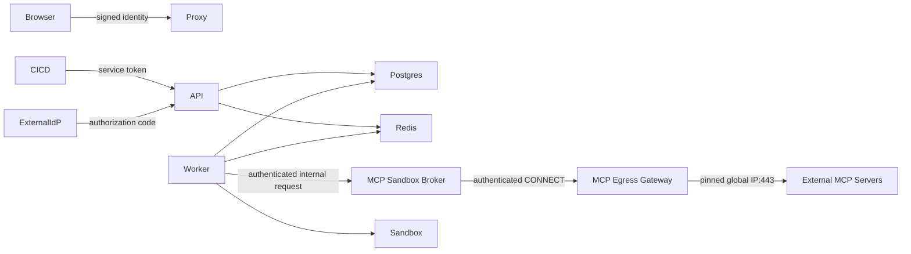

# MCP Control Plane Threat Model

## Assets

- Repository source and index data;
- MCP Registry credentials, OAuth client secrets and delegated user tokens;
- Tenant policy, approvals, execution ledger and quota ledger;
- Agent workspace and generated patches;
- Evaluation/admin identities and security audit evidence.

## Trust boundaries

External MCP responses, Tool descriptions and schemas are untrusted input. Redis is trusted for real-time coordination but PostgreSQL remains the durable source of execution and accounting evidence.

## Primary threats and controls

| Threat | Control | Residual risk |
|---|---|---|
| Cross-Tenant Tool access | Tenant binding, Repository scope, principal grants, deny-overrides-allow | Misconfigured wildcard grants |
| Model invokes unauthorized Tool | Deterministic Router validation outside the model | Local policy configuration error |
| Destructive Tool runs silently | approval-required policy and durable HITL checkpoint | Compromised approver identity |
| Retry duplicates side effect | Durable idempotency ledger and remote metadata contract | Server ignores idempotency metadata |
| Timeout hides remote success | `unknown` state and manual reconciliation | Human may reconcile incorrectly |
| Credential theft from DB | Per-credential AES-GCM data key, AWS KMS envelope and encryption context | Compromised application IAM role |
| OAuth code interception | state hash, expiry, one-time consumption and PKCE S256 | Compromised browser/session |
| SSRF/DNS rebinding through Registry/OAuth URL | Internal-only Broker, authenticated Egress Gateway, exact host/port allowlist, Gateway-side DNS resolution, global-IP enforcement and pinned TCP connect | Compromised allowlisted destination |
| Quota bypass under concurrency | Redis Lua atomic multi-policy check plus DB policy locks | Redis/PostgreSQL temporary drift |
| Quota drift after partial failure | Scheduled locked reconciliation and durable evidence | Calls denied briefly during repair |
| Replay of proxy identity | Signed identity, timestamp and Redis nonce consumption | Redis outage causes fail-closed admin access |
| Remote MCP workload escapes network boundary | Non-root/read-only/cap-drop Broker on internal-only network; no mounts; all egress through policy Gateway | Container-runtime or kernel vulnerability |
| Code-test container escape | General Worker has no Docker socket; a credential-isolated Broker revalidates command/image/workspace and starts a network-disabled, read-only, cap-dropped container | Docker daemon and host kernel remain the final isolation boundary |
| Compliance control silently drifts | Scheduled integrity-bound reports, negative egress canary, readiness failure and SIEM/S3 audit delivery | Simultaneous compromise of runtime and evidence sinks |
| Audit tampering | Durable outbox, signed SIEM delivery, SHA-256 and S3 COMPLIANCE Object Lock | SIEM and cloud-account administrator collusion |

## High-priority deployment requirements

1. Use AWS KMS envelope encryption and inject remaining service tokens from Secret Manager/IAM, not committed `.env` files.
2. Put PostgreSQL, Redis, Qdrant and MCP endpoints on private networks with TLS.
3. Do not expose the Docker socket to untrusted workloads; prefer dedicated sandbox nodes.
4. Export security audit records to immutable remote storage/SIEM.
5. Require signed browser identity and Redis nonce store in production.
6. Use staging for migrations, load tests and failure drills before production rollout.

## Explicitly accepted MVP risks

- Quota Redis and PostgreSQL are not a single distributed transaction; reconciliation detects and repairs drift.
- Local JSONL remains an emergency fallback; authoritative audit evidence is the SIEM plus Object-Locked S3 copy.
- Tool output is size bounded and treated as untrusted, but semantic prompt-injection detection remains probabilistic.
- The code-sandbox Broker no longer controls a host Docker daemon. Execution is delegated over mTLS with request-bound workload identity to a managed Firecracker/Kubernetes plane. Residual risk is concentrated in the external Firecracker launcher/Kata runtime and, for Kubernetes, the single-replica in-memory replay cache until a shared strongly consistent replay store is introduced.
